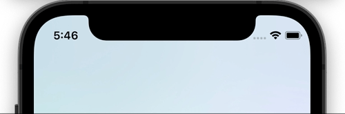

# react-native-toast-message

Animated toast message component for React Native.

## Features

- 🚀 Imperative API
- 📦 Very lightweight (~40 kB)
- ⌨️ Keyboard-aware
- 🎨 Customizable layouts
- 🔧 Flexible config

## Documentation

> This is the documentation for `react-native-toast-message@v2`, which has a similar API to v1, but contains a few important changes. [Read the complete changelog](https://github.com/calintamas/react-native-toast-message/releases/tag/v2.0.0).

- [Quick start](./docs/quick-start.md)
- [API](./docs/api.md)
- [Create custom layouts](./docs/custom-layouts.md)
- FAQ
  - [How to show the Toast inside a Modal?](./docs/modal-usage.md)
  - [How to render the Toast when using a Navigation library?](./docs/navigation-usage.md)
  - [How to mock the library for testing with jest?](./docs/jest-testing.md)

## License

MIT
