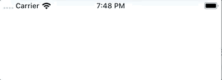

# react-native-toast-message

[](https://www.npmjs.com/package/react-native-toast-message)
[](https://www.npmjs.com/package/react-native-toast-message)
[](https://github.com/calintamas/react-native-toast-message/actions?query=workflow%3Atests)
[](https://github.com/prettier/prettier)

Animated toast message component for React Native.

- Imperative API
- Keyboard aware
- Flexible config

## Install

```
yarn add react-native-toast-message
```



## Usage

Render the `Toast` component in your app entry file (along with everything that might be rendered there) and set a ref to it.

```js
// App.jsx
import Toast from 'react-native-toast-message';

function App(props) {
  return (
    <>
      {/* ... */}
      <Toast ref={(ref) => Toast.setRef(ref)} />
    </>
  );
}

export default App;
```

Then use it anywhere in your app (even outside React components), by calling any `Toast` method directly:

```js
import Toast from 'react-native-toast-message';

function SomeComponent() {
  React.useEffect(() => {
    Toast.show({
      text1: 'Hello',
      text2: 'This is some something 👋'
    });
  }, []);

  return <View />;
}
```

## API

### `show(options = {})`

When calling the `show` method, you can use the following `options` to suit your needs. Everything is optional, unless specified otherwise.

The usage of `|` below, means that only one of the values show should be used.
If only one value is shown, that's the default.

```js
Toast.show({
  type: 'success | error | info',
  position: 'top | bottom',
  text1: 'Hello',
  text2: 'This is some something 👋',
  visibilityTime: 4000,
  autoHide: true,
  topOffset: 30,
  bottomOffset: 40,
  onShow: () => {},
  onHide: () => {},
  onPress: () => {}
});
```

### `hide()`

```js
Toast.hide();
```

## props

Props that can be set on the `Toast` instance. They act as defaults for all Toasts that are shown.

```js
const props = {
  config: Object,
  style: ViewStyle,
  topOffset: Number,
  bottomOffset: Number,
  keyboardOffset: Number,
  visibilityTime: Number,
  autoHide: Boolean,
  height: Number,
  position: 'top' | 'bottom',
  type: String
};
```

> Default `Animated.View` styles can be found in [styles.js](https://github.com/calintamas/react-native-toast-message/blob/master/src/styles.js#L4). They can be extended using the `style` prop.

## Customize Toast types

If you want to add custom types - or overwrite the existing ones - you can add a `config` prop when rendering the `Toast` in your app `root`.

```js
// App.jsx
import Toast from 'react-native-toast-message';

const toastConfig = {
  success: ({ text1, props, ...rest }) => (
    <View style={{ height: 60, width: '100%', backgroundColor: 'pink' }}>
      <Text>{text1}</Text>
      <Text>{props.guid}</Text>
    </View>
  ),
  error: () => {},
  info: () => {},
  any_custom_type: () => {}
};

function App(props) {
  return (
    <>
      {/* ... */}
      <Toast config={toastConfig} ref={(ref) => Toast.setRef(ref)} />
    </>
  );
}

export default App;
```

Then just use the library as before

```js
Toast.show({
  type: 'any_custom_type',
  props: { onPress: () => {}, guid: 'guid-id' }
});
```

## Change default Toast style

In addition to creating Toast styles from scratch (shown above), you can use the default `BaseToast` style and adjust its layout.

```js
// App.jsx
import Toast, { BaseToast } from 'react-native-toast-message';

const toastConfig = {
  success: ({ text1, ...rest }) => (
    <BaseToast
      {...rest}
      style={{ borderLeftColor: 'pink' }}
      contentContainerStyle={{ paddingHorizontal: 15 }}
      text1Style={{
        fontSize: 15,
        fontWeight: 'semibold'
      }}
      text1={text1}
      text2={null}
    />
  )
};

function App(props) {
  return (
    <>
      {/* ... */}
      <Toast config={toastConfig} ref={(ref) => Toast.setRef(ref)} />
    </>
  );
}

export default App;
```

Available `props` on `BaseToast`:

```js
const baseToastProps = {
  leadingIcon: ImageSource,
  trailingIcon: ImageSource,
  text1: String,
  text2: String,
  onPress: Function,
  onLeadingIconPress: Function,
  onTrailingIconPress: Function,
  style: ViewStyle,
  leadingIconContainerStyle: ViewStyle,
  trailingIconContainerStyle: ViewStyle,
  leadingIconStyle: ViewStyle,
  trailingIconStyle: ViewStyle,
  contentContainerStyle: ViewStyle,
  text1Style: ViewStyle,
  text2Style: ViewStyle,
  activeOpacity: Number
};
```

## Credits

The icons for the default `success`, `error` and `info` types are made by [Pixel perfect](https://www.flaticon.com/authors/pixel-perfect) from [flaticon.com](www.flaticon.com).
